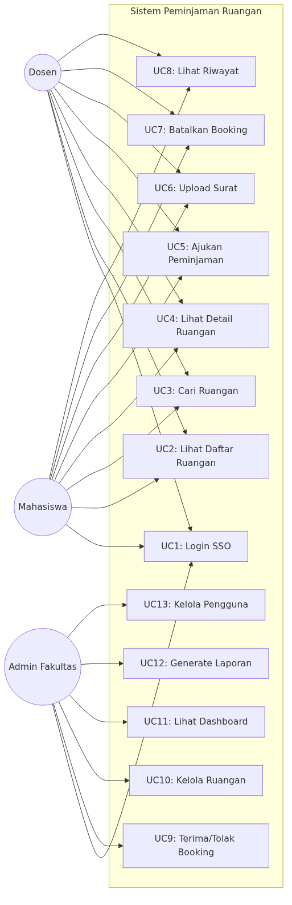
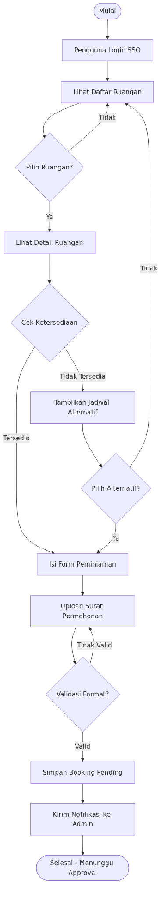
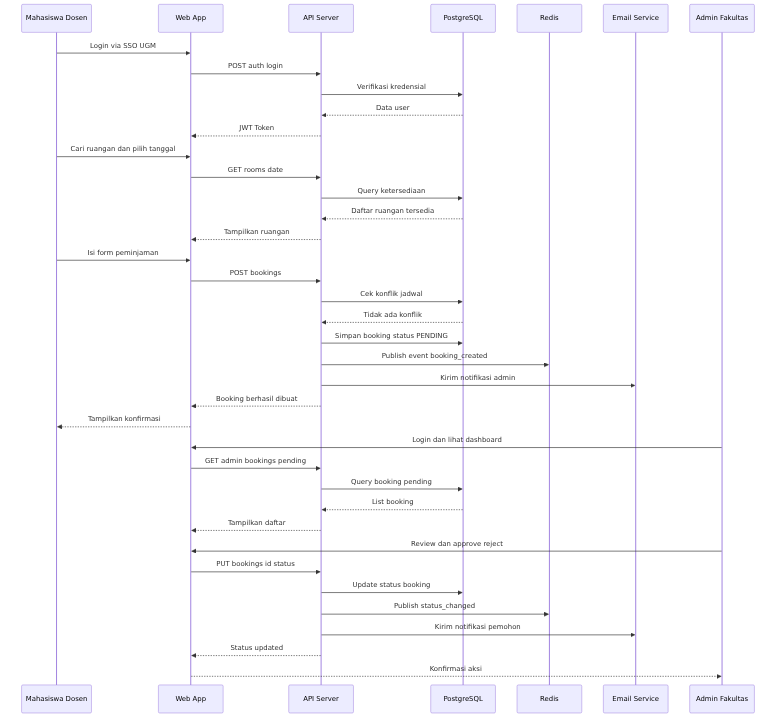
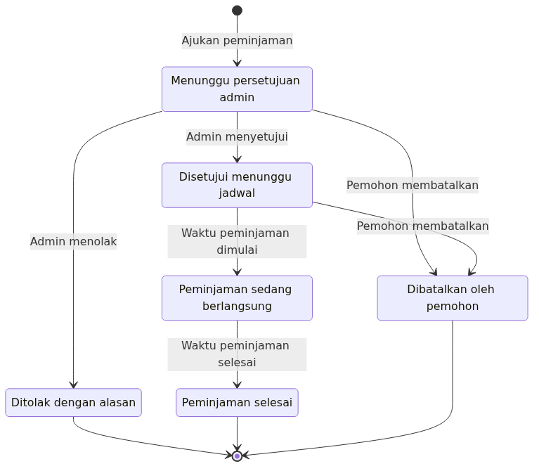
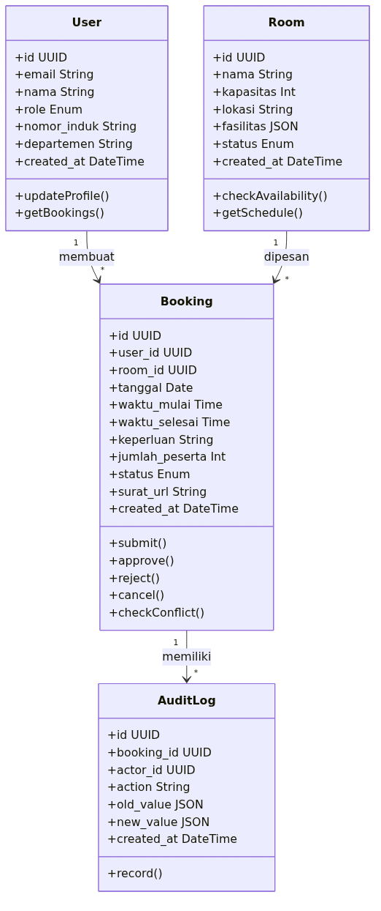
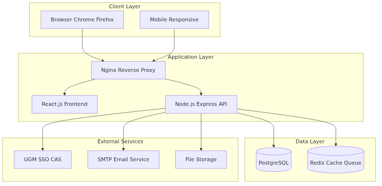
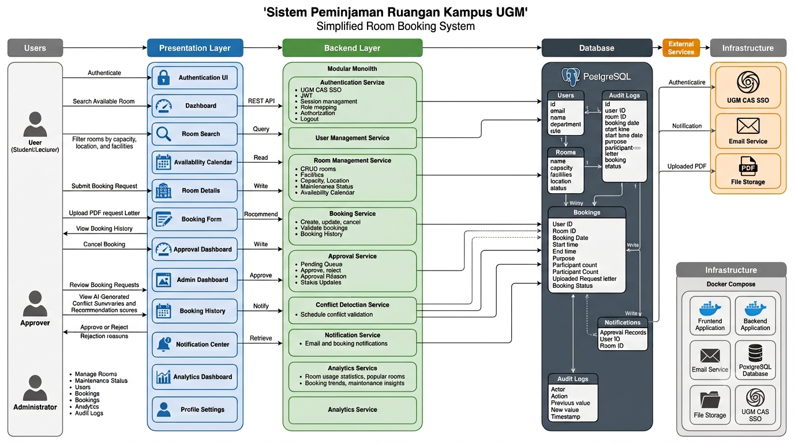

# initial-plan.pdf

Pages: 15

## Page 1

Laporan 
Pengembangan Perangkat Lunak 
Sistem Peminjaman Ruangan Kampus UGM 
 
 
 
 
 
 
 
 
 
 
 
 
  DISUSUN OLEH: 
Aldi Indrawan​
​
​
(25/557923/PPA/07038) 
Dimas Ihdam Maulana​
​
(25/562999/PPA/07090) 
Hanan Fakhira Rima Wibowo ​
(25/564467/PPA/07122) 
Prima Adi Pradana​ ​
  ​
(25/568512/PPA/07150) 
 
 
 
 
DEPARTEMEN ILMU KOMPUTER DAN ELEKTRONIKA 
FAKULTAS MATEMATIKA DAN ILMU PENGETAHUAN ALAM 
UNIVERSITAS GADJAH MADA 
YOGYAKARTA 
2026
 
 

## Page 2

Daftar Isi 
 
Daftar Isi.........................................................................................................................................1 
1. Functional Requirements.......................................................................................................... 2 
A. Manajemen Autentikasi dan Akses.......................................................................................2 
B. Manajemen Ruangan dan Ketersediaan................................................................................2 
C. Manajemen Booking............................................................................................................. 2 
D. Approval Workflow.............................................................................................................. 3 
2. Product Design Hierarchy.........................................................................................................3 
A. Persona..................................................................................................................................3 
B. Scenario.................................................................................................................................4 
C. User Story..............................................................................................................................4 
D. Feature Identification............................................................................................................5 
3. Desain UML................................................................................................................................7 
A. Use Case Diagram.................................................................................................................7 
B. Flowchart Proses Booking.................................................................................................... 8 
C. Sequence Diagram.................................................................................................................9 
D. State Diagram Booking Lifecycle.......................................................................................10 
E. Class Diagram......................................................................................................................11 
F. Deployment Diagram...........................................................................................................13 
G. Desain Arsitektur................................................................................................................ 13 
 
1 

## Page 3

1.​ Functional Requirements 
Pada bagian ini, akan dijelaskan mengenai kumpulan kemampuan yang wajib disediakan 
sistem agar proses booking ruangan dapat berjalan sesuai kebutuhan organisasi. 
A.​ Manajemen Autentikasi dan Akses 
Manajemen autentikasi dan akses merupakan fungsi yang memastikan bahwa 
setiap pengguna hanya dapat mengakses fitur sesuai dengan kewenangannya. 
Dalam konteks sistem ini, pengguna melakukan login melalui akun institusi atau 
mekanisme SSO, kemudian sistem mengidentifikasi role pengguna dan 
menampilkan hak akses yang sesuai. Fungsi ini penting karena sistem harus 
membedakan akses antara pengguna pemohon, approver, dan administrator. 
Dengan demikian, fitur ini mendukung prinsip pemodelan use case yang berbasis 
role, bukan berbasis individu. 
Sub-fungsi dalam manajemen ini meliputi: 
●​ Autentikasi Pengguna 
●​ Pemetaan Role 
●​ Pembatasan Menu Berdasarkan Role 
●​ Logout 
●​ Pencatatan Aktivitas Pengguna 
Use case diagram: relasi antara User, Approver, Admin, dan sistem autentikasi 
B.​ Manajemen Ruangan dan Ketersediaan 
Manajemen ruangan dan ketersediaan berfungsi untuk mengatur data ruangan 
yang tersedia di dalam organisasi. Informasi yang dikelola meliputi nama 
ruangan, kapasitas, fasilitas, lokasi, status, dan slot waktu yang tersedia. Fungsi 
ini menjadi inti dari sistem karena pengguna harus dapat menemukan ruangan 
yang sesuai dengan kebutuhan mereka tanpa perlu memeriksa jadwal secara 
manual.  
Sub-fungsi dalam manajemen ini meliputi: 
●​ Menambah ruangan baru 
●​ Mengubah data ruangan 
●​ Menandai ruangan sebagai tersedia atau tidak tersedia 
●​ Menampilkan kalender ketersediaan 
●​ Memfilter ruangan berdasarkan kapasitas dan fasilitas 
Diagram class yang memperlihatkan hubungan antara Room, Facility, dan Booking 
C.​ Manajemen Booking 
Manajemen booking adalah fungsi yang memungkinkan pengguna mengajukan 
pemesanan ruangan pada tanggal dan waktu tertentu. Sistem kemudian 
memproses permintaan tersebut, memeriksa konflik jadwal, dan menyimpan 
status booking.  
Sub-fungsi dalam manajemen ini meliputi: 
●​ Membuat booking baru 
2 

## Page 4

●​ Mengubah booking 
●​ Membatalkan booking 
●​ Melihat status booking 
●​ Menampilkan booking aktif 
●​ Mengirim notifikasi booking 
Flowchart proses booking, sequence diagram interaksi user, backend, db, dan layanan notifikasi 
D.​ Approval Workflow 
Approval workflow adalah fungsi yang mengatur apakah sebuah booking perlu 
disetujui terlebih dahulu sebelum dianggap final. Dalam sistem ini, booking 
tertentu dapat masuk ke status pending, lalu diperiksa oleh approver, dan 
kemudian disetujui atau ditolak.  
Sub-fungsi dalam manajemen ini meliputi: 
●​ Perubahan status booking ke pending 
●​ Notifikasi ke approver 
●​ Keputusan approve atau reject 
●​ Pencatatan alasan penolakan 
●​ Pengiriman hasil keputusan ke pemohon 
 
2.​ Product Design Hierarchy 
Product design hierarchy pada materi disusun dari persona, scenario, user story, 
hingga feature identification. Persona berfungsi sebagai representasi pengguna yang 
membantu tim memahami kebutuhan nyata, scenario menjelaskan konteks penggunaan 
sistem, user story memecah kebutuhan menjadi bagian yang lebih terstruktur, dan feature 
identification merangkum fungsi yang akan dibangun. 
 
A.​ Persona 
Persona disusun berdasarkan role agar selaras dengan konsep actor pada use case. 
Persona yang digunakan dalam proyek ini diposisikan sebagai role utama yang 
mewakili pola kebutuhan pengguna.  
1)​ User / Pemohon Booking 
User merupakan role yang mewakili pengguna reguler sistem, yaitu pihak 
yang mengajukan booking ruangan untuk rapat, diskusi, presentasi, atau 
kegiatan organisasi. Role ini membutuhkan proses pencarian ruangan yang 
cepat, rekomendasi ruangan yang sesuai, serta kepastian status booking.  
2)​ Admin / Pengelola Ruangan 
Admin merupakan role yang bertanggung jawab untuk memeriksa dan 
memutuskan permohonan booking, sekaligus mengelola data ruangan dan 
memantau operasional sistem. Dalam konteks proyek, role ini dapat diisi 
oleh dosen penanggung jawab, kepala divisi, atau pihak yang diberi 
otoritas untuk menyetujui penggunaan ruangan. Role ini bertugas 
3 

## Page 5

menambahkan 
ruangan, 
memperbarui 
fasilitas, 
mengubah 
status 
maintenance, dan memastikan data ruangan tetap akurat.  
 
B.​ Scenario 
Scenario merupakan narasi yang menggambarkan bagaimana pengguna 
menggunakan sistem untuk mencapai tujuan tertentu.  
1)​ Scenario 1: User mengajukan booking ruangan 
Seorang user membuka sistem untuk mencari ruangan yang tersedia pada 
hari dan jam tertentu. Setelah memilih kapasitas dan kebutuhan fasilitas, 
sistem menampilkan daftar ruangan yang sesuai. Sistem kemudian 
memberikan rekomendasi ruangan terbaik berdasarkan data ketersediaan, 
kapasitas, dan fasilitas. Setelah itu, user memilih salah satu ruangan dan 
mengajukan booking. Apabila booking tidak berbenturan dengan jadwal 
lain, sistem menyimpannya sebagai permintaan yang siap diproses lebih 
lanjut atau langsung disetujui sesuai kebijakan yang berlaku. 
2)​ Scenario 2: Approver meninjau permintaan booking 
Seorang approver menerima notifikasi bahwa terdapat booking baru yang 
membutuhkan keputusan. Approver membuka detail permintaan dan 
meninjau informasi ruangan, waktu penggunaan, potensi konflik jadwal, 
serta ringkasan rekomendasi dari sistem. Jika permintaan dianggap sesuai, 
approver menyetujuinya. Jika terdapat masalah, approver menolak 
permintaan dan menambahkan alasan. Setelah keputusan dibuat, sistem 
memperbarui status booking dan mengirimkan pemberitahuan kepada 
user. 
3)​ Scenario 3: Admin mengelola ruangan 
Seorang admin membuka dashboard pengelolaan untuk menambah 
ruangan baru atau memperbarui data ruangan yang sudah ada. Admin juga 
dapat menandai ruangan sebagai maintenance ketika ruangan sedang tidak 
dapat digunakan.  
 
C.​ User Story 
User story merupakan narasi yang lebih kecil dan lebih terstruktur dibanding 
scenario. 
1)​ Story 1: Booking oleh User 
●​ Sebagai user, saya ingin melihat daftar ruangan yang tersedia pada 
waktu tertentu agar saya dapat memilih ruangan yang paling sesuai 
dengan kebutuhan kegiatan saya. 
●​ Sebagai user, saya ingin sistem memberikan rekomendasi ruangan 
terbaik agar saya tidak perlu membandingkan seluruh ruangan 
secara manual. 
4 

## Page 6

●​ Sebagai user, saya ingin mengajukan booking secara langsung 
setelah memilih ruangan agar proses pemesanan menjadi lebih 
cepat dan efisien. 
Tabel backlog user story dengan kolom epic, story, prioritas, dan status implementasi. 
2)​ Story 2: Approval oleh Approver 
●​ Sebagai approver, saya ingin melihat detail booking sebelum 
memberikan keputusan agar saya dapat menilai apakah permintaan 
tersebut sesuai dengan jadwal dan kebijakan yang berlaku. 
●​ Sebagai approver, saya ingin melihat ringkasan konflik dan 
rekomendasi dari sistem agar saya dapat mengambil keputusan 
lebih cepat. 
●​ Sebagai approver, saya ingin menolak booking yang tidak sesuai 
agar ruangan tidak digunakan secara tidak tepat. 
Sequence diagram approval 
3)​ Story 3: Administrasi oleh Admin 
●​ Sebagai admin, saya ingin menambahkan data ruangan baru agar 
sistem selalu memiliki informasi ruangan yang mutakhir. 
●​ Sebagai admin, saya ingin memperbarui fasilitas ruangan agar 
pengguna 
dapat 
memilih 
ruangan 
yang 
sesuai 
dengan 
kebutuhannya. 
●​ Sebagai admin, saya ingin menandai ruangan sebagai maintenance 
agar ruangan tersebut tidak dapat dipesan sementara. 
●​ Sebagai admin, saya ingin melihat pola penggunaan ruangan agar 
saya dapat memahami kebutuhan operasional organisasi dengan 
lebih baik. 
 
D.​ Feature Identification 
Feature identification merupakan tahap menurunkan scenario dan user story 
menjadi daftar fitur yang konkret. Berdasarkan tiap fitur, skenario, user story, dan 
fungsi utama yang ada, dapat diringkas sebagai berikut: 
 
Feature 
Sumber Utama 
Fungsi Utama 
Autentikasi dan akses role 
Scenario 1-3 
Mengidentifikasi pengguna dan 
mengatur hak akses 
Lihat ketersediaan ruangan 
Story 1 
Menampilkan slot ruangan yang 
kosong 
Rekomendasi ruangan 
Story 1 
Memberi saran ruangan yang 
paling sesuai 
5 

## Page 7

Ajukan booking 
Story 1 
Membuat permintaan pemesanan 
Approval booking 
Story 2 
Menyetujui atau menolak 
booking 
Kelola data ruangan 
Story 3 
Menambah dan memperbarui 
data ruangan 
Ubah status maintenance 
Story 3 
Menandai ruangan tidak dapat 
digunakan 
Notifikasi status booking 
Semua scenario 
Mengirim hasil keputusan 
booking 
Audit log 
Semua scenario 
Menyimpan riwayat aktivitas 
 
Sementara, untuk pengecekan prioritas tiap requirement adalah sebagai berikut: 
ID 
Requirement 
Prioritas 
FR-01 
Sistem harus mendukung autentikasi SSO 
UGM (CAS) 
Harus Ada 
FR-02 
Sistem harus menyediakan daftar ruangan 
dengan filter kapasitas, lokasi, fasilitas 
Harus Ada 
FR-03 
Sistem harus menampilkan ketersediaan 
ruangan real-time 
Harus Ada 
FR-04 
Sistem harus mendukung pengajuan 
peminjaman dengan form online 
Harus Ada 
FR-05 
Sistem harus mendukung upload surat 
permohonan (PDF, max 5MB) 
Harus Ada 
FR-06 
Sistem harus mendeteksi konflik jadwal 
otomatis 
Harus Ada 
FR-07 
Sistem harus menampilkan jadwal alternatif 
jika ruangan penuh 
Disarankan Ada 
FR-08 
Sistem harus mengirim notifikasi email untuk 
setiap perubahan status 
Harus Ada 
FR-09 
Sistem harus menyediakan dashboard admin 
untuk approval 
Harus Ada 
FR-10 
Sistem harus mencatat audit log untuk setiap 
aksi 
Harus Ada 
FR-11 
Sistem harus mendukung pembatalan booking 
oleh pemohon 
Disarankan Ada 
FR-12 
Sistem harus menyediakan riwayat 
peminjaman untuk pengguna 
Disarankan Ada 
6 

## Page 8

3.​ Desain UML 
UML digunakan untuk memvisualisasikan sistem dari berbagai perspektif, yaitu external, 
interaction, structural, dan behavioral. Oleh karena itu, desain UML untuk sistem 
booking ruangan sebaiknya tidak hanya terdiri dari satu diagram, melainkan beberapa 
diagram yang masing-masing menjelaskan aspek tertentu dari sistem. 
Tabel-tabel utama yang digunakan pada database untuk UML ini antara lain: 
●​ users 
id, email, nama, role, nomor_induk, departemen, created_at 
●​ rooms 
id, nama, kapasitas, lokasi, fasilitas, status, created_at 
●​ bookings 
id, 
user_id, 
room_id, 
tanggal, 
waktu_mulai, 
waktu_selesai, 
keperluan, 
jumlah_peserta, status, surat_url, created_at 
●​ audit_logs 
id, booking_id, actor_id, action, old_value, new_value, created_at 
 
A.​ Use Case Diagram 
Use case diagram digunakan untuk menggambarkan hubungan antara aktor dan 
fungsi utama sistem. Dalam sistem ini, aktor yang ditampilkan meliputi user, 
approver atau dosen penanggung jawab, admin, serta layanan pendukung bila 
diperlukan. Use case diagram ini menjadi alat yang tepat untuk memperlihatkan 
scope sistem secara eksternal dan memetakan kebutuhan fungsional utama. 
7 

## Page 9

 
B.​ Flowchart Proses Booking 
Flowchart proses booking digunakan untuk memperlihatkan urutan logika mulai 
dari login, pencarian ruangan, pengecekan ketersediaan, pemberian rekomendasi 
AI, pengajuan booking, evaluasi konflik, hingga hasil akhir booking. Diagram ini 
sangat sesuai untuk menjelaskan logic sistem secara ringkas dan mudah dipahami 
sebelum masuk ke implementasi. 
8 

## Page 10

 
C.​ Sequence Diagram 
Sequence diagram digunakan untuk menunjukkan urutan interaksi antara user, 
backend, database, modul AI, dan layanan notifikasi. Diagram ini sangat sesuai 
untuk alur booking karena dapat memperlihatkan pesan yang dikirim antar objek 
secara berurutan. Dalam sistem AI-based, sequence diagram juga dapat 
9 

## Page 11

memperlihatkan kapan rekomendasi ruangan dihitung dan kapan hasilnya dikirim 
ke user. 
 
 
D.​ State Diagram Booking Lifecycle 
State diagram digunakan untuk menunjukkan perubahan status booking dari draft 
menjadi pending, approved, rejected, cancelled, atau completed. Diagram ini 
relevan karena booking memang memiliki lifecycle yang berubah seiring waktu. 
State chart berguna untuk memodelkan sistem sebagai kumpulan state dengan 
transisi yang dipicu oleh kondisi tertentu. 
10 

## Page 12

 
E.​ Class Diagram 
Class diagram digunakan untuk menggambarkan struktur data dan hubungan antar 
entitas utama sistem, seperti User, Room, Booking, Approval, Notification, dan 
Audit Log. Diagram ini termasuk dalam perspektif struktural dan sangat 
membantu untuk menjelaskan desain basis data dan relasi antar objek. Dalam 
sistem AI-based, class tambahan seperti Recommendation atau ConflictDetector 
juga dapat ditampilkan jika diperlukan. 
11 

## Page 13

 
12 

## Page 14

F.​ Deployment Diagram 
Deployment diagram digunakan untuk memperlihatkan komponen sistem pada 
level infrastruktur, seperti frontend, backend monolith, database, dan layanan 
eksternal. Diagram ini cocok untuk menunjukkan bahwa sistem dirancang dengan 
arsitektur yang sederhana, realistis, dan sesuai dengan batas waktu pengerjaan. 
Dalam konteks proyek mahasiswa, deployment diagram juga membantu 
menjelaskan bagaimana sistem dapat dijalankan menggunakan Docker Compose 
atau lingkungan serupa. 
 
G.​ Desain Arsitektur 
Berikut adalah desain arsitektur untuk perangkat lunak yang akan kami 
kembangkan dalam proyek ini: 
 
 
13 

## Page 15

Catatan tambahan: Berdasarkan ruang lingkup permasalahan, kebutuhan, serta 
alur proses yang telah dijelaskan sebelumnya, proyek ini tidak memerlukan 
penerapan AI karena seluruh aktivitas dan proses bisnis yang diusulkan telah 
dapat berjalan secara efektif dengan pendekatan sistem informasi konvensional. 
Dengan demikian, penggunaan AI bukan merupakan kebutuhan fungsional dalam 
proyek ini. 
 
Namun, apabila penggunaan AI diwajibkan sebagai bagian dari penugasan atau 
kriteria penilaian, maka penerapannya akan disampaikan pada bagian 
Rekomendasi. Salah satu contoh implementasi AI yang dapat ditambahkan adalah 
sebagai fitur pendukung bagi admin untuk memberikan rekomendasi ruangan 
yang paling sesuai berdasarkan kebutuhan atau kriteria peminjaman. 
 
14 

